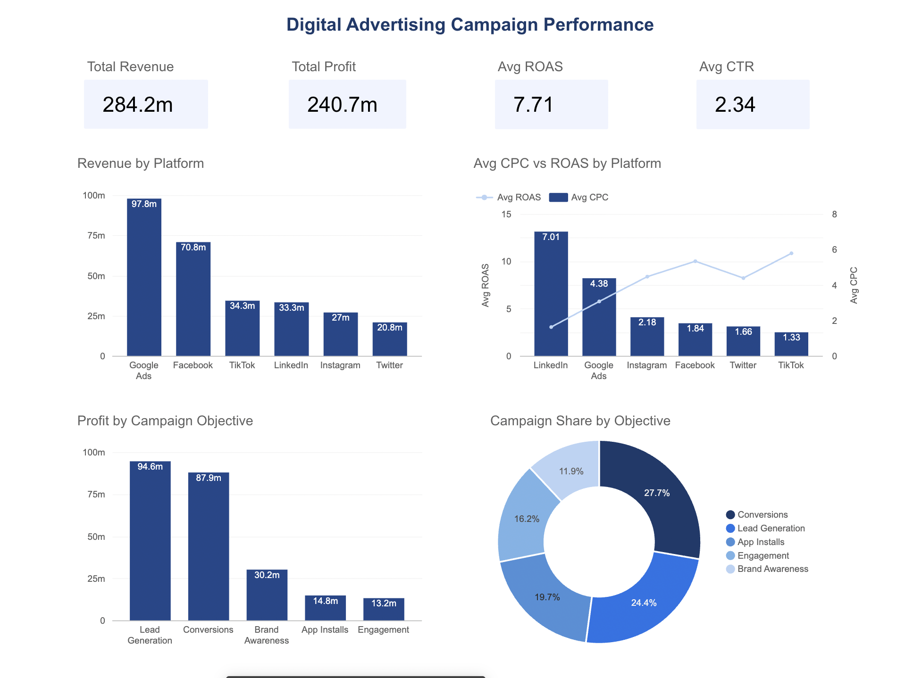
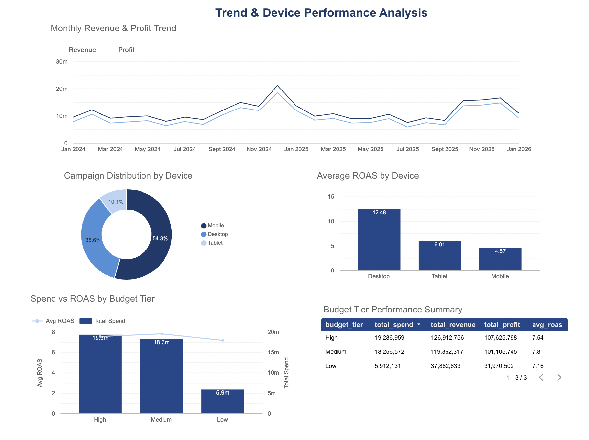

# Digital Advertising Campaign Performance Analysis

## Project Overview
End-to-end analysis of 10,000 digital advertising campaigns across 6 platforms (Google Ads, Facebook, TikTok, LinkedIn, Instagram, Twitter) using DuckDB, SQL and Looker Studio.

## Objectives
- Identify the most profitable platforms and campaign objectives
- Analyze ROAS and conversion rate trends across devices and budget tiers
- Build an executive dashboard for marketing performance monitoring

## Tools & Stack
- **DuckDB** — local SQL engine for data modeling
- **Python** — pipeline orchestration
- **Looker Studio** — interactive dashboard
- **Google Sheets** — data source connector

## Project Structure
```
├── 1_staging.sql       # Data cleaning and standardization
├── 2_kpi_models.sql    # KPI aggregations by platform, objective, device, budget
├── 3_export.sql        # CSV exports for Looker Studio
└── run_sql.py          # Pipeline runner
```

## SQL Pipeline Details

**`1_staging.sql`** — Loads the raw CSV using DuckDB, filters out invalid rows (zero impressions or spend), standardizes column names and casts date fields. Creates the `stg_campaigns` table used by all downstream models.

**`2_kpi_models.sql`** — Builds 5 aggregated tables from the staging layer:
- `kpi_by_platform` — revenue, spend, ROAS, CTR and conversion rate per platform
- `kpi_by_objective` — profitability and conversion metrics per campaign objective
- `kpi_by_device` — performance breakdown by device type
- `kpi_monthly_trend` — month-over-month revenue, profit and ROAS evolution
- `kpi_by_budget_tier` — spend efficiency analysis across budget tiers

**`3_export.sql`** — Exports all 5 KPI tables to CSV for ingestion into Looker Studio via Google Sheets.

## Dataset
Source: [Digital Advertising Campaign Performance Dataset](https://www.kaggle.com/datasets/juniornsa/digital-advertising-campaign-performance-dataset) — 10,000 rows, 41 columns, Jan 2024 to Jan 2026.

## Dashboard
[View the Looker Studio Dashboard](https://datastudio.google.com/reporting/9e38a23e-1fa4-4cad-b643-7f7e3df6e086)

## Dashboard Preview

### Page 1 — Campaign & Platform Performance


### Page 2 — Trend & Device Analysis


## Key Findings
- **TikTok** delivers the highest average ROAS (10.85) at the lowest CPC ($1.33), making it the most cost-efficient platform in this dataset
- **LinkedIn** is the most expensive channel (avg CPC $7.01) with the lowest ROAS (3.05), making it the least cost-efficient platform
- **Lead Generation** and **Conversions** drive over 75% of total profit. **Brand Awareness**, despite being a common objective, generates 3x less profit than Lead Generation. **Engagement** and **App Installs** contribute less than 6% each
- **Low budget tier** achieves similar ROAS (7.16) to High tier (7.8) despite 70% less spend, suggesting that increasing budget does not proportionally improve efficiency
- **Desktop** delivers nearly 3x higher ROAS (12.48) than Mobile (4.57), despite Mobile accounting for over 54% of all campaigns, suggesting a significant budget reallocation opportunity toward Desktop
- Revenue peaked in **December 2024** suggesting seasonal patterns worth investigating
